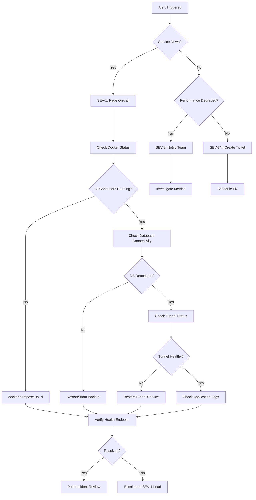

# Operations Guide

**Author**: Operations Team  
**Purpose**: Day-to-day operational procedures  
**Audience**: DevOps, SRE, Platform Engineers

---

## API Key Rotation (Zero-Downtime)

### Overview

API keys can be rotated without service interruption by temporarily allowing multiple keys per workspace during the transition period.

### Procedure

#### Step 1: Generate New API Key

```powershell
# Run the key generator with a new name
cd mcp_server
python generate_api_key.py "workspace-a-key-2026-04"

# Output format:
# Plaintext API Key (give to client):
#   <NEW_PLAINTEXT_KEY>
#
# RAG_API_KEYS entry (add to .env):
#   <NEW_HMAC_HASH>:<WORKSPACE_UUID>
```

**Important**: Save both the plaintext key (for client) and the HMAC entry (for server).

#### Step 2: Add New Key to Server (No Restart Required)

```bash
# Edit .env and ADD the new key (keep old key for now)
RAG_API_KEYS=<OLD_HMAC>:<WORKSPACE_UUID>,<NEW_HMAC>:<WORKSPACE_UUID>

# Restart the MCP service to load new config
docker compose restart mcp

# Verify both keys work
curl -H "X-API-Key: <OLD_PLAINTEXT_KEY>" http://localhost:8080/health
curl -H "X-API-Key: <NEW_PLAINTEXT_KEY>" http://localhost:8080/health
```

Both keys should return `{"status":"ok"}`.

#### Step 3: Migrate Clients

Distribute the new plaintext key to all clients and update their configuration. This can happen gradually over days/weeks.

Monitor logs to see when old key usage drops to zero:

```powershell
# Check recent API calls by key
docker compose logs mcp --tail=1000 | Select-String "X-API-Key"
```

#### Step 4: Remove Old Key

After confirming all clients have migrated:

```bash
# Edit .env and REMOVE the old key
RAG_API_KEYS=<NEW_HMAC>:<WORKSPACE_UUID>

# Restart service
docker compose restart mcp

# Verify old key is rejected
curl -H "X-API-Key: <OLD_PLAINTEXT_KEY>" http://localhost:8080/health
# Should return 401 Unauthorized
```

### Grace Period Recommendation

- **Minimum**: 7 days
- **Recommended**: 30 days for production workloads
- **Extended**: 90 days for enterprise clients with change control windows

---

## Database Backup & Restore

### Backup Procedure

#### Daily Automated Backup

```bash
#!/bin/bash
# backup.sh - Add to cron: 0 2 * * * /path/to/backup.sh

BACKUP_DIR="/backups/notion_mcp"
TIMESTAMP=$(date +%Y%m%d_%H%M%S)
BACKUP_FILE="$BACKUP_DIR/notion_mcp_$TIMESTAMP.sql"

# Create backup directory if it doesn't exist
mkdir -p "$BACKUP_DIR"

# Backup with compression
docker compose exec -T db pg_dump -U postgres notion_mcp | gzip > "$BACKUP_FILE.gz"

# Keep last 30 days of backups
find "$BACKUP_DIR" -name "notion_mcp_*.sql.gz" -mtime +30 -delete

echo "Backup completed: $BACKUP_FILE.gz"
```

#### Manual Backup

```powershell
# Windows PowerShell
$timestamp = Get-Date -Format "yyyyMMdd_HHmmss"
$backupFile = "notion_mcp_backup_$timestamp.sql"

docker compose exec -T db pg_dump -U postgres notion_mcp > $backupFile

# Compress for storage
Compress-Archive -Path $backupFile -DestinationPath "$backupFile.zip"
Remove-Item $backupFile

Write-Host "Backup saved: $backupFile.zip"
```

### Restore Procedure

⚠️ **WARNING**: This will overwrite the current database. Verify backup integrity first.

#### Step 1: Stop Application

```bash
docker compose stop mcp
```

#### Step 2: Drop and Recreate Database

```bash
docker compose exec db psql -U postgres -c "DROP DATABASE IF EXISTS notion_mcp;"
docker compose exec db psql -U postgres -c "CREATE DATABASE notion_mcp;"
docker compose exec db psql -U postgres -d notion_mcp -c "CREATE EXTENSION IF NOT EXISTS pgcrypto;"
docker compose exec db psql -U postgres -d notion_mcp -c "CREATE EXTENSION IF NOT EXISTS vector;"
```

#### Step 3: Restore from Backup

```bash
# If backup is compressed
gunzip notion_mcp_backup.sql.gz

# Restore
cat notion_mcp_backup.sql | docker compose exec -T db psql -U postgres -d notion_mcp

# Or on Windows:
Get-Content notion_mcp_backup.sql | docker compose exec -T db psql -U postgres -d notion_mcp
```

#### Step 4: Verify and Restart

```bash
# Verify schema
docker compose exec db psql -U postgres -d notion_mcp -c "\dt"

# Restart application
docker compose start mcp

# Test health endpoint
curl http://localhost:8080/health
```

### Restore Testing

**Quarterly Drill**: Test restore procedure to verify backup integrity

```bash
# Create test database
docker compose exec db psql -U postgres -c "CREATE DATABASE notion_mcp_restore_test;"

# Restore to test database
cat latest_backup.sql | docker compose exec -T db psql -U postgres -d notion_mcp_restore_test

# Verify row counts match
docker compose exec db psql -U postgres -d notion_mcp -c "SELECT COUNT(*) FROM rag_sources;"
docker compose exec db psql -U postgres -d notion_mcp_restore_test -c "SELECT COUNT(*) FROM rag_sources;"

# Clean up test database
docker compose exec db psql -U postgres -c "DROP DATABASE notion_mcp_restore_test;"
```

---

## RTO/RPO Definitions

### Current SLA Targets

| Metric | Target | Notes |
| -------- | -------- | ------- |
| **RTO** (Recovery Time Objective) | 1 hour | Time to restore service after incident |
| **RPO** (Recovery Point Objective) | 24 hours | Maximum data loss acceptable |
| **Availability** | 99.5% | ~3.6 hours downtime per month |

### Incident Response

#### Severity Levels

| Level | Definition | Response Time | Examples |
|-------|------------|---------------|----------|
| **SEV-1** (Critical) | Service completely down, data loss risk | 15 minutes | Database offline, total service outage, RLS bypass discovered |
| **SEV-2** (High) | Degraded performance, partial outage | 1 hour | Slow queries, tunnel intermittent, authentication failures |
| **SEV-3** (Medium) | Minor issues, workaround available | 4 hours | Single endpoint errors, logging issues |
| **SEV-4** (Low) | Cosmetic, no user impact | Next business day | Documentation typos, metric collection gaps |

#### Response Procedure



#### Step-by-Step Response

**1. DETECT** (0-5 minutes)

- Monitor health endpoint fails 3 consecutive times
- PagerDuty/alert fires
- User reports issue

**2. ACKNOWLEDGE** (Within response time SLA)

- Acknowledge alert in paging system
- Post to #incidents Slack channel: `[SEV-X] Brief description - Investigating`
- Assign incident commander (first responder)

**3. ASSESS** (5-15 minutes)

```powershell
# Quick diagnostic checklist
docker compose ps                          # Are containers running?
docker compose logs mcp --tail=50         # Recent errors?
curl https://mcp.tenantsage.org/health    # External access?
curl http://localhost:8080/health         # Internal access (tunnel bypass)?


---

## Monitoring & Alerting

### Health Check Monitoring

**Recommended**: Set up external monitoring (e.g., UptimeRobot, Pingdom, Datadog)

```bash
# Endpoint to monitor
https://mcp.tenantsage.org/health

# Expected response
{"status":"ok"}

# Alert on:
- HTTP status != 200
- Response time > 5 seconds
- 3 consecutive failures
```

### Log Monitoring

```powershell
# View recent logs
docker compose logs mcp --tail=100 --follow

# Filter for errors
docker compose logs mcp | Select-String "ERROR|CRITICAL"

# Check database health
docker compose exec db pg_isready -U postgres
```

---

## Scaling Operations

### Horizontal Scaling (Multi-Instance)

#### Prerequisites

1. Redis must be running:

```bash
docker compose --profile scale up -d redis
```

2.Add to `.env`:

```bash
REDIS_URL=redis://redis:6379/0
```

3.Restart MCP service:

```bash
docker compose restart mcp
```

#### Deploy Additional Instances

```bash
# Scale to 3 instances
docker compose up -d --scale mcp=3

# Verify all instances healthy
docker compose ps mcp
```

#### Load Balancer Configuration

Add nginx or HAProxy in front of multiple MCP instances:

```nginx
# /etc/nginx/nginx.conf
upstream mcp_backend {
    least_conn;
    server localhost:8080;
    server localhost:8081;
    server localhost:8082;
}

server {
    listen 80;
    location / {
        proxy_pass http://mcp_backend;
        proxy_set_header X-API-Key $http_x_api_key;
    }
}
```

---

## Security Operations

### Certificate Rotation (Cloudflare Universal SSL)

Cloudflare handles certificate renewal automatically. No action required.

Verify current certificate:

```bash
curl -vI https://mcp.tenantsage.org/health 2>&1 | grep -i "expire"
```

### Secret Rotation

Rotate these secrets quarterly:

1. **RAG_SERVER_SECRET**
2. **ACTOR_SIGNING_SECRET**
3. **POSTGRES_PASSWORD**
4. **Cloudflare Tunnel Token** (if compromised)

See "API Key Rotation" section above for zero-downtime procedure.

---

## Troubleshooting

### Service Won't Start

```bash
# Check logs
docker compose logs mcp --tail=50

# Common issues:
- Missing environment variables → Check .env file
- Database not ready → Wait for db healthcheck to pass
- Port 8080 in use → Change ports in docker-compose.yml
```

### Database Connection Errors

```bash
# Verify database is healthy
docker compose exec db pg_isready -U postgres

# Check database logs
docker compose logs db --tail=50

# Test connection from MCP container
docker compose exec mcp python -c "
import os
import psycopg2
conn = psycopg2.connect(os.getenv('RAG_DATABASE_URL'))
print('Connection OK')
"
```

### Tunnel Not Working

```powershell
# Check cloudflared service
Get-Service cloudflared

# Restart if needed
Restart-Service cloudflared

# Check event logs
Get-EventLog -LogName Application -Source cloudflared -Newest 10
```

---

## Maintenance Windows

### Recommended Schedule

- **Database Backups**: Daily at 2:00 AM UTC
- **Log Rotation**: Weekly
- **Security Updates**: Apply within 7 days of release
- **Backup Testing**: Quarterly
- **Secret Rotation**: Quarterly
- **Dependency Updates**: Monthly review via Dependabot

### Planned Maintenance Procedure

1. **Notify users** 72 hours in advance
2. **Create backup** immediately before maintenance
3. **Enable maintenance mode** (503 response at reverse proxy)
4. **Perform updates**
5. **Run preflight validation**: `python production_preflight.py --strict`
6. **Smoke test critical paths**
7. **Disable maintenance mode**
8. **Monitor for 30 minutes post-deployment**

---

## Appendix: Quick Reference

### Essential Commands

```bash
# View service status
docker compose ps

# Restart services
docker compose restart mcp

# View logs (last 100 lines)
docker compose logs mcp --tail=100

# Database backup
docker compose exec -T db pg_dump -U postgres notion_mcp > backup.sql

# Run preflight check
cd mcp_server && python production_preflight.py --strict

# Health check
curl https://mcp.tenantsage.org/health
```

### Contact Information & Escalation

#### On-Call Rotation

| Role | Primary | Backup | Contact Method |
|------|---------|--------|----------------|
| **L1 - On-call Engineer** | [Name] | [Name] | PagerDuty, Slack @username, +1-XXX-XXX-XXXX |
| **L2 - Platform Lead** | [Name] | [Name] | PagerDuty escalation, Slack @username, +1-XXX-XXX-XXXX |
| **L3 - Engineering Manager** | [Name] | [Name] | Email, Slack @username, +1-XXX-XXX-XXXX |
| **L4 - VP Engineering** | [Name] | - | Email (SEV-1 only) |

#### Escalation Path

```
SEV-4 (Low) → L1 resolves during business hours
SEV-3 (Medium) → L1 investigates, may consult L2
SEV-2 (High) → L1 leads, L2 assists, notify L3 if > 2 hours
SEV-1 (Critical) → Page L1 + L2 immediately, brief L3 within 30 min
```

#### Communication Channels

| Channel | Purpose | SEV-1 | SEV-2 | SEV-3/4 |
|---------|---------|-------|-------|---------|
| **#incidents** (Slack) | Real-time incident coordination | Required | Required | Optional |
| **#mcp-alerts** (Slack) | Automated monitoring alerts | Auto | Auto | Auto |
| **Status Page** | External customer communication | Update every 30 min | Update hourly | Not required |
| **Email** | Stakeholder notifications | Send initial + resolution | Send resolution only | Not required |
| **PagerDuty** | On-call paging | Auto-page | Auto-page | Ticket only |

#### Incident Commander Responsibilities

The first responder becomes the **Incident Commander** until resolved or explicitly handed off:

1. **Own the incident** - Primary decision maker
2. **Coordinate response** - Bring in additional engineers as needed
3. **Communicate status** - Update Slack #incidents every 15-30 minutes  
4. **Track timeline** - Document key events for post-mortem
5. **Declare resolution** - Ensure service fully restored before closing
6. **Schedule post-mortem** - Within 48 hours for SEV-1/2

#### Communication Templates

**SEV-1 Initial Alert (Slack #incidents)**
```
🚨 [SEV-1] MCP Service Down - INVESTIGATING

Impact: Complete service outage, all API requests failing
Start Time: YYYY-MM-DD HH:MM UTC
Commander: @username
Status: Investigating root cause

Initial Actions:
- [ ] Docker containers checked
- [ ] Database connectivity checked
- [ ] Tunnel status checked
- [ ] Backup restoration initiated (if needed)

Next Update: HH:MM UTC
```

**SEV-1 Resolution (Slack #incidents + Email)**
```
✅ [RESOLVED] SEV-1 MCP Service Down

Impact: Complete service outage
Duration: X hours Y minutes (HH:MM - HH:MM UTC)
Root Cause: [Brief summary]
Resolution: [What fixed it]

Service Status: FULLY OPERATIONAL
Verified By: Production preflight tests passing

Post-Mortem: Scheduled for [date]
```

#### Vendor Contacts

| Vendor | Service | Support Portal | Emergency Contact |
|--------|---------|----------------|-------------------|
| **Cloudflare** | Tunnel | https://dash.cloudflare.com/support | Enterprise support ticket |
| **PostgreSQL Community** | Database | https://www.postgresql.org/support/ | Community forums |
| **Docker** | Container Platform | https://www.docker.com/support/ | Community forums |

---

**Last Updated**: April 8, 2026  
**Next Review**: July 8, 2026  
**Document Owner**: Operations Team
